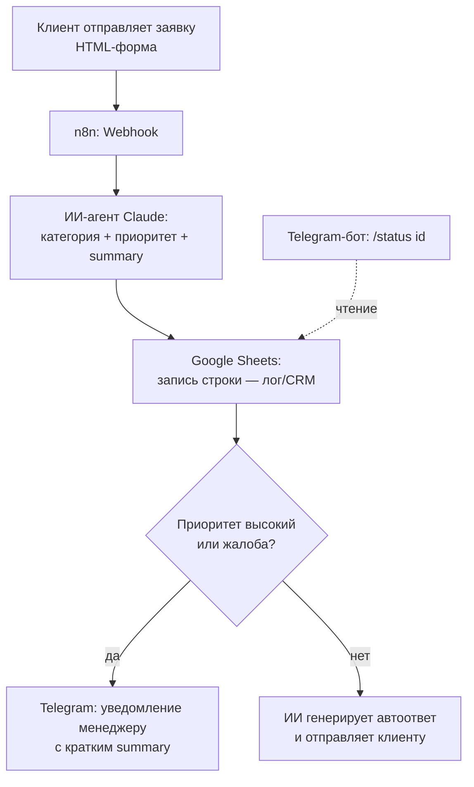

# Smart Intake Automation

Автоматизация обработки входящих заявок: n8n-сценарий + ИИ-агент (Claude), который классифицирует заявку, кладёт её в Google Sheets как лёгкую CRM, уведомляет менеджера о срочных случаях и сам отвечает на типовые вопросы. Плюс внутренний Telegram-бот для проверки статуса заявки.

Проект сделан как демонстрация одного цельного кейса, а не набора несвязанных скриптов: разбор ручного процесса → алгоритм → n8n-сценарий → ИИ-агент → внутренний бот.

## Проблема ("было")

Типичная ручная обработка заявок в маленькой команде:

- заявки приходят вперемешку — почта, форма на сайте, чат — единого входа нет;
- никто не расставляет приоритеты: жалоба и вопрос "работаете ли вы по выходным" ждут ответа одинаково долго;
- сортировка и первичный ответ отнимают у менеджера время каждый день, хотя большая часть заявок — типовые;
- часть заявок теряется или отвечается с опозданием, потому что не видно, что уже обработано, а что нет.

Разрыв цепочки: нет момента, где заявка **гарантированно** попадает в одно место и получает метку "что это и насколько срочно".

## Решение ("стало")



Каждая заявка теперь гарантированно проходит через один и тот же алгоритм: попадает в таблицу, получает категорию и приоритет, и либо уходит менеджеру как требующая внимания, либо клиент сразу получает ответ без участия человека.

## Стек и почему

| Часть | Инструмент | Почему |
|---|---|---|
| Оркестрация | [n8n](https://n8n.io) (self-hosted, `npx n8n`) | низкий код, вебхуки и API "из коробки", легко показать сценарий визуально |
| Классификация/автоответ | Anthropic Claude (нода AI Agent / Chat Model) | нативная интеграция в n8n, дёшево для коротких классификаций |
| Хранилище заявок | Google Sheets | не требует поднимать БД, у большинства небольших команд уже есть — реалистичная заглушка вместо полноценной CRM |
| Уведомления/бот | Telegram Bot API | бесплатно, мгновенная настройка через @BotFather |
| Демо-вход | статическая HTML-форма | не нужен бэкенд, чтобы показать пайплайн end-to-end |

### Расширение на Bitrix24

В вакансиях часто фигурирует именно Bitrix24 как CRM. В этом MVP он не подключён (нет доступа к порталу), но сценарий расширяется без изменения архитектуры: нода Google Sheets "Append Row" заменяется на **HTTP Request** к `crm.lead.add` (или `crm.deal.add`) через входящий вебхук Bitrix24 (`https://<портал>.bitrix24.ru/rest/<user_id>/<webhook_code>/crm.lead.add.json`). Остальной пайплайн (классификация → приоритизация → уведомление/автоответ) не меняется — это и есть смысл собирать процесс как алгоритм, а не как связку под один конкретный сервис.

## Структура репозитория

```
smart-intake-automation/
├── README.md
├── form/
│   └── index.html          — демо-форма заявки
├── n8n/
│   ├── workflow-intake.json       — основной пайплайн
│   └── workflow-status-bot.json   — Telegram-бот статуса
└── docs/
    └── (сюда позже — скриншоты / GIF демо-прогона)
```

## Как запустить

### 1. Поднять n8n локально

Docker не нужен — n8n запускается через Node.js:

```bash
npx n8n
```

Откроется на `http://localhost:5678`. При первом запуске n8n попросит создать локального пользователя (это учётка только внутри самого n8n, не онлайн-сервис).

### 2. Завести доступы (сделать самостоятельно — я не создаю аккаунты за вас)

- **Google Sheets**: создать таблицу с колонками `id, timestamp, name, contact, message, category, priority, summary, status`. Для подключения n8n к Google Sheets: в ноде Google Sheets → Create New Credential → n8n откроет стандартный Google OAuth-консент (не нужен отдельный проект в Google Cloud Console для личного использования).
- **Telegram-бот**: написать [@BotFather](https://t.me/BotFather) в Telegram → `/newbot` → получить токен. Написать боту любое сообщение, чтобы узнать свой `chat_id` (например через `/getUpdates` в Bot API или бота @userinfobot).
- **Anthropic API key**: получить на [console.anthropic.com](https://console.anthropic.com) → API Keys. Требует привязки способа оплаты, но расход на классификацию коротких заявок минимален.

### 3. Импортировать сценарии

В n8n UI: `⋯` → **Import from File** → выбрать `n8n/workflow-intake.json`, затем `n8n/workflow-status-bot.json`.

В каждом workflow подключить свои credentials (Google Sheets, Anthropic, Telegram) в соответствующих нодах — они отмечены комментариями (sticky notes) прямо в сценарии.

### 4. Прогнать демо

Открыть `form/index.html` в браузере, в коде поправить константу `WEBHOOK_URL` на адрес вебхука из n8n (Production URL ноды Webhook), отправить тестовую заявку и посмотреть:

- строка появилась в Google Sheets;
- пришло Telegram-уведомление (для срочной заявки) или автоответ (для обычной);
- команда `/status <id>` в Telegram-боте возвращает статус этой заявки.

## Демо

*(сюда — скриншоты или GIF реального прогона после первого теста)*
