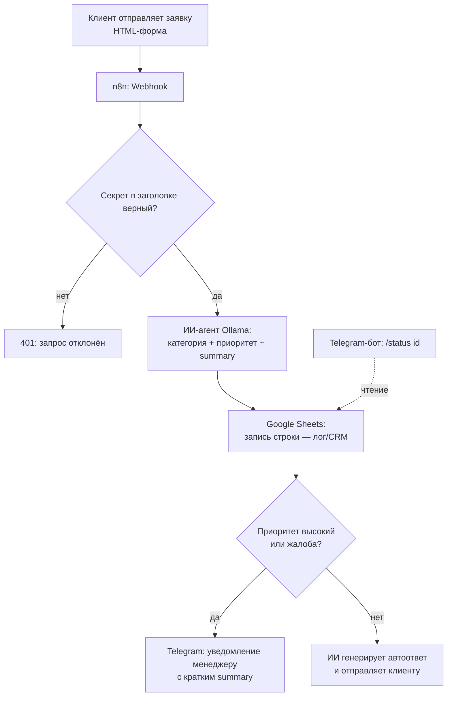
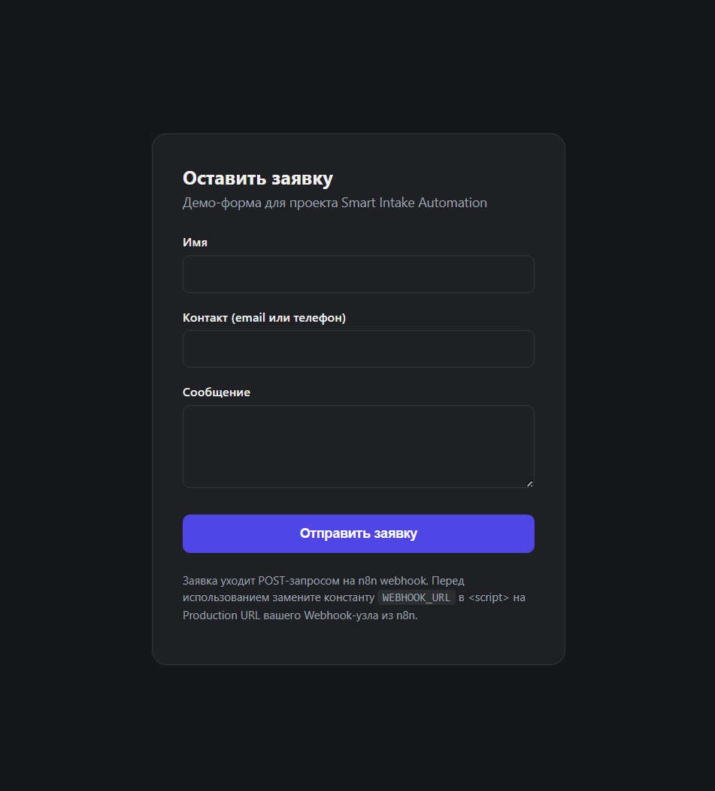
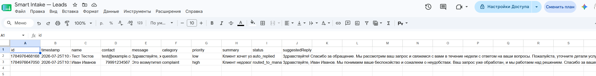
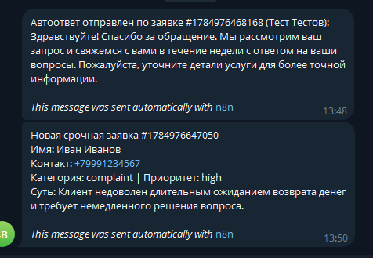

# Smart Intake Automation

Автоматизация обработки входящих заявок: n8n-сценарий + ИИ-агент (локальная LLM через Ollama), который классифицирует заявку, кладёт её в Google Sheets как лёгкую CRM, уведомляет менеджера о срочных случаях и сам отвечает на типовые вопросы. Плюс внутренний Telegram-бот для проверки статуса заявки.

Проект сделан как демонстрация одного цельного кейса, а не набора несвязанных скриптов: разбор ручного процесса → алгоритм → n8n-сценарий → ИИ-агент → внутренний бот.

## Проблема ("было")

Типичная ручная обработка заявок в маленькой команде:

- заявки приходят вперемешку — почта, форма на сайте, чат — единого входа нет;
- никто не расставляет приоритеты: жалоба и вопрос "работаете ли вы по выходным" ждут ответа одинаково долго;
- сортировка и первичный ответ отнимают у менеджера время каждый день, хотя большая часть заявок — типовые;
- часть заявок теряется или отвечается с опозданием, потому что не видно, что уже обработано, а что нет.

Разрыв цепочки: нет момента, где заявка **гарантированно** попадает в одно место и получает метку "что это и насколько срочно".

## Решение ("стало")



Каждая заявка теперь гарантированно проходит через один и тот же алгоритм: попадает в таблицу, получает категорию и приоритет, и либо уходит менеджеру как требующая внимания, либо клиент сразу получает ответ без участия человека.

## Стек и почему

| Часть | Инструмент | Почему |
|---|---|---|
| Оркестрация | [n8n](https://n8n.io) (self-hosted, `npx n8n`) | низкий код, вебхуки и API "из коробки", легко показать сценарий визуально |
| Классификация/автоответ | Локальная LLM через [Ollama](https://ollama.com) (`gpt-oss:20b`, HTTP Request к `/api/chat` + JSON-schema `format` для гарантированно валидного JSON, `think: "medium"` — у reasoning-моделей вроде gpt-oss рассуждения нельзя выключить совсем, только понизить уровень) | без внешних API, без ключей и лимитов; изначально пробовали Google Gemini free tier — уткнулись в постоянный `429` (бесплатная квота фактически недоступна для аккаунтов не из поддерживаемого региона), поэтому переехали на локальную модель |
| Хранилище заявок | Google Sheets | не требует поднимать БД, у большинства небольших команд уже есть — реалистичная заглушка вместо полноценной CRM |
| Уведомления/бот | Telegram Bot API | бесплатно, мгновенная настройка через @BotFather |
| Демо-вход | статическая HTML-форма | не нужен бэкенд, чтобы показать пайплайн end-to-end |

### Почему `think: "medium"`, а не `"low"`

Изначально стояло `think: "low"` — быстрее, но при повторных прогонах одной и той же жалобы на возврат денег модель примерно в 1 из 5 запусков (даже при `temperature: 0`) классифицировала её как `spam` вместо `complaint` — то есть реальная срочная жалоба тихо ушла бы в автоответ вместо алерта менеджеру. Это особенность части MoE-моделей вроде gpt-oss: параллельные вычисления дают небольшой разброс результата даже без температуры. На `think: "medium"` погрешность не воспроизвелась за 5/5 прогонов (медленнее — прибавляет несколько секунд на запрос, но для этой задачи разница не критична).

### Расширение на Bitrix24

В вакансиях часто фигурирует именно Bitrix24 как CRM. В этом MVP он не подключён (нет доступа к порталу), но сценарий расширяется без изменения архитектуры: нода Google Sheets "Append Row" заменяется на **HTTP Request** к `crm.lead.add` (или `crm.deal.add`) через входящий вебхук Bitrix24 (`https://<портал>.bitrix24.ru/rest/<user_id>/<webhook_code>/crm.lead.add.json`). Остальной пайплайн (классификация → приоритизация → уведомление/автоответ) не меняется — это и есть смысл собирать процесс как алгоритм, а не как связку под один конкретный сервис.

## Структура репозитория

```
smart-intake-automation/
├── README.md
├── form/
│   └── index.html          — демо-форма заявки
├── n8n/
│   ├── workflow-intake.json       — основной пайплайн
│   └── workflow-status-bot.json   — Telegram-бот статуса
└── docs/
    ├── demo-form.png            — демо-форма
    ├── demo-google-sheets.png   — результат в Google Sheets
    └── demo-telegram.png        — уведомления в Telegram
```

## Как запустить

### 1. Поднять n8n локально

Docker не нужен — n8n запускается через Node.js:

```bash
npx n8n
```

Откроется на `http://localhost:5678`. При первом запуске n8n попросит создать локального пользователя (это учётка только внутри самого n8n, не онлайн-сервис).

Для проверки shared-secret на вебхуке (см. раздел "Безопасность") нужна переменная окружения, так что на практике запуск выглядит так:

```bash
INTAKE_SHARED_SECRET=ваш-секрет N8N_BLOCK_ENV_ACCESS_IN_NODE=false npx n8n
```

(В n8n Variables — платная фича, поэтому секрет передаётся через `$env`, а не `$vars`. А `N8N_BLOCK_ENV_ACCESS_IN_NODE=false` нужен, потому что начиная с какой-то версии n8n по умолчанию блокирует нодам доступ к переменным окружения — без этого флага нода "Check Shared Secret" не сможет прочитать `$env.INTAKE_SHARED_SECRET` и упадёт с `access to env vars denied`.)

### 2. Завести доступы (сделать самостоятельно — я не создаю аккаунты за вас)

- **Google Sheets**: создать таблицу с колонками `id, timestamp, name, contact, message, category, priority, summary, status`. Self-hosted n8n требует собственный OAuth Client ID/Secret из [Google Cloud Console](https://console.cloud.google.com) (Google Sheets API + Google Drive API включены, redirect URI — `http://localhost:5678/rest/oauth2-credential/callback`), затем вход через Google прямо в форме credential.
- **Telegram-бот**: написать [@BotFather](https://t.me/BotFather) в Telegram → `/newbot` → получить токен. Написать боту любое сообщение, чтобы узнать свой `chat_id` (например через `/getUpdates` в Bot API или бота @userinfobot).
- **Ollama**: установить [ollama.com](https://ollama.com), скачать модель (`ollama pull gpt-oss:20b`) и держать сервер запущенным (`ollama serve`). Если n8n и Ollama на разных машинах в одной сети — Ollama нужно запустить с `OLLAMA_HOST=0.0.0.0:11434`, чтобы он слушал не только localhost, и открыть порт 11434 в файрволе (лучше ограничить доступ локальной подсетью). Ключ/токен не нужен.

### 3. Импортировать сценарии

В n8n UI: `⋯` → **Import from File** → выбрать `n8n/workflow-intake.json`, затем `n8n/workflow-status-bot.json`.

В каждом workflow подключить свои credentials (Google Sheets, Telegram) и указать адрес своего Ollama-сервера в ноде "Classify with Ollama" — они отмечены комментариями (sticky notes) прямо в сценарии.

Убедитесь, что n8n запущен с переменной `INTAKE_SHARED_SECRET` (см. шаг 1) — нода "Check Shared Secret" сверяет её с заголовком `x-intake-secret` во входящем запросе, отклоняя всё остальное (см. раздел "Безопасность" ниже).

**Про статус-бота отдельно:** `workflow-status-bot.json` использует ноду `Telegram Trigger`, а Telegram API принимает webhook только по HTTPS. На локальном `http://localhost:5678` активировать эту ноду не получится ("Bad Request: bad webhook: An HTTPS URL must be provided for webhook") — нужен публичный HTTPS-адрес (туннель вроде ngrok/Cloudflare Tunnel или деплой n8n с реальным сертификатом). Основной пайплайн (`workflow-intake.json`) от этого не зависит — он только отправляет сообщения в Telegram, а не принимает, поэтому прекрасно работает на localhost.

### 4. Прогнать демо

Открыть `form/index.html` в браузере, в коде поправить константы `WEBHOOK_URL` (Production URL ноды Webhook) и `INTAKE_SECRET` (то же значение, что в переменной окружения `INTAKE_SHARED_SECRET`, которой запущен n8n), отправить тестовую заявку и посмотреть:

- строка появилась в Google Sheets;
- пришло Telegram-уведомление (для срочной заявки) или автоответ (для обычной);
- команда `/status <id>` в Telegram-боте возвращает статус этой заявки (требует публичный HTTPS, см. выше).

## Демо

Реальный прогон: одна обычная заявка (вопрос про стоимость) и одна срочная жалоба.

**Демо-форма**



**Результат в Google Sheets** — обе заявки классифицированы (category/priority/summary/suggestedReply), статусы `auto_replied` и `routed_to_manager`:



**Уведомления в Telegram** — автоответ клиенту по обычной заявке и алерт менеджеру по срочной жалобе:



## Безопасность

Прогнала security-аудит (secrets archaeology по всей git-истории + разбор webhook/LLM/OWASP-поверхности). Полная история — [issue #3](https://github.com/nastyaaaay/smart-intake-automation/issues/3).

- **Секретов в репозитории и его истории нет** — ни ключей, ни токенов, ни `.env`.
- **Webhook защищён shared-secret заголовком** (`x-intake-secret`, нода "Check Shared Secret") — раньше эндпоинт принимал вообще любой POST без проверки, что позволяло бы засыпать Telegram фейковыми "срочными жалобами" и накручивать бесплатные вызовы LLM. Пофиксено.
- **Known limitation**: секрет лежит в JS-константе на клиенте (`form/index.html`) — это отсекает случайный/автоматический спам по угаданному URL, но не остановит того, кто откроет DevTools и прочитает исходник страницы. Для полноценной защиты публичной формы нужен бэкенд-прокси, который добавляет заголовок сам, не раскрывая секрет клиенту — но для демо-проекта без бэкенда это осознанный компромисс, не забытый недочёт.
- **Rate limiting не реализован** — при реальном деплое стоит добавить его на уровне reverse-proxy (nginx `limit_req` и т.п.).

## Лицензия

[MIT](LICENSE)
